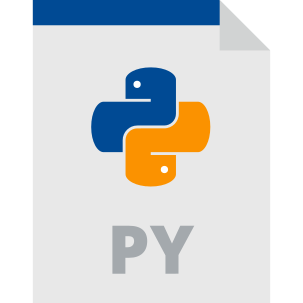

### Hi there, my name is **Omisore Dotun!**  
&nbsp;&nbsp;

---

## I'm a DevOps Engineer and a Technical Writer!
- 🌱 I’m currently learning **Cloud Computing**
- 🥅 One of my 2022 goals is to become a **DevOps engineer**
- 👯 I’m looking forward to collaborating on any **DevOps projects**
- 😄 Pronouns:Him/He 
- ⚡ Fun fact: I love sports, especially **soccer**

---

### Connect with me:

&nbsp;&nbsp;

&nbsp;&nbsp;

---

### Languages and Tools:

&nbsp;&nbsp;

&nbsp;&nbsp;

&nbsp;&nbsp;

&nbsp;&nbsp;

&nbsp;&nbsp;

&nbsp;&nbsp;

---

# 📩 New Blog Posts
<!-- BLOG-POST-LIST:START -->
- [AWS 3-tier Architecture](https://learntodevops.hashnode.dev/aws-3-tier-architecture)
- [The Osi Model](https://learntodevops.hashnode.dev/the-osi-model)
- [Networking Devices](https://learntodevops.hashnode.dev/networking-devices)
- [Computer Networking](https://learntodevops.hashnode.dev/computer-networking)
- [Flow Control in Bash Scripting](https://learntodevops.hashnode.dev/flow-control-in-bash-scripting)
<!-- BLOG-POST-LIST:END -->

---

